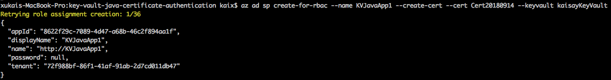
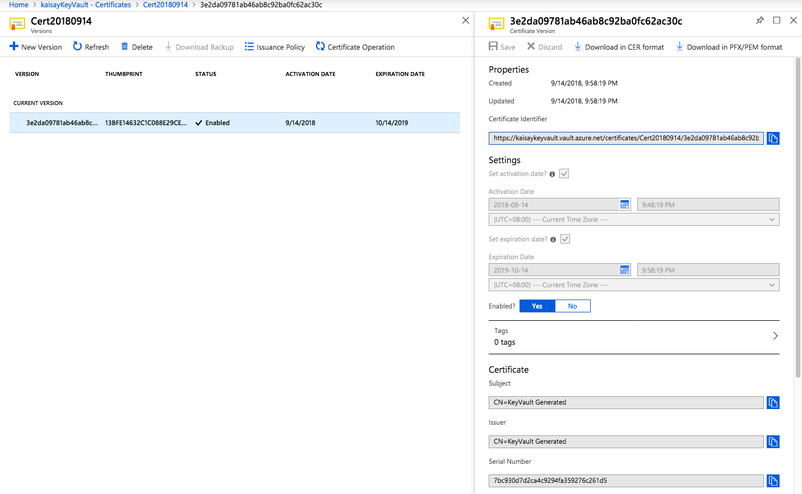
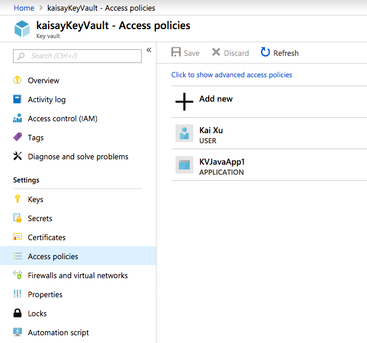
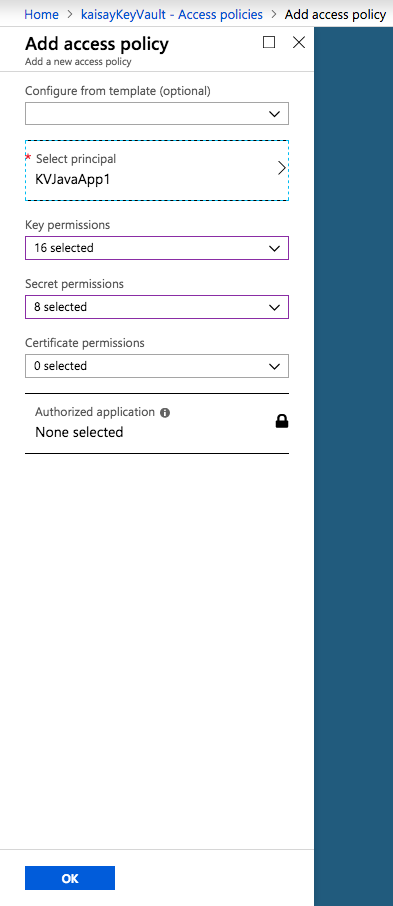
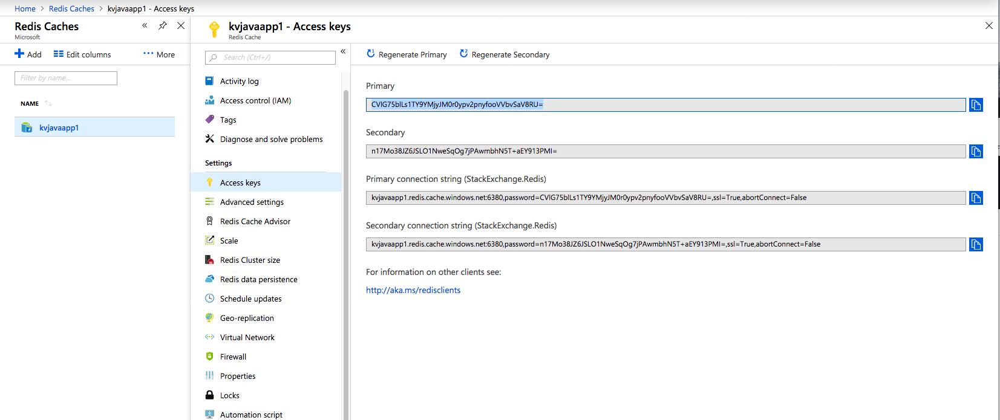
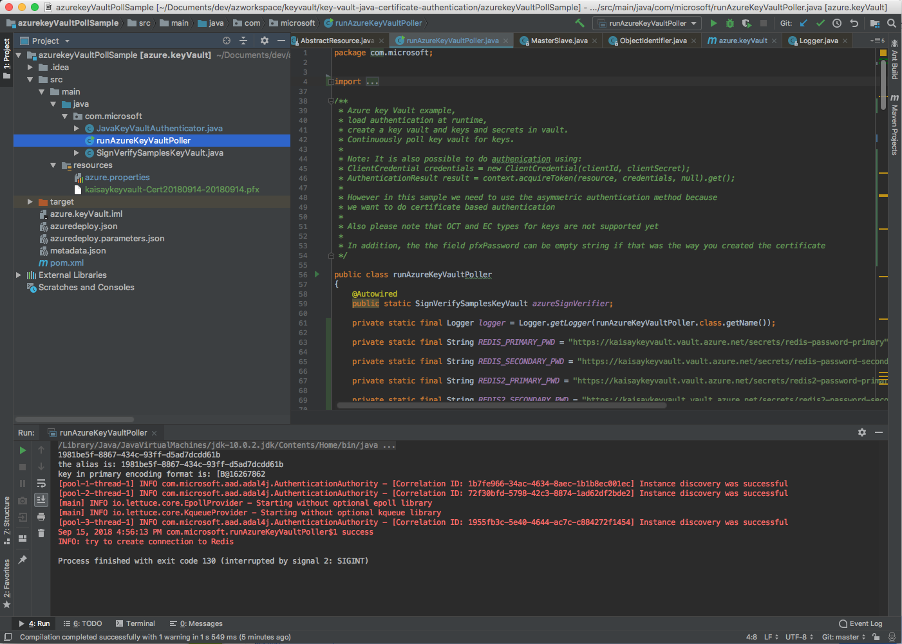

# 如何使用Azure KeyVault管理Java应用访问Redis


完整实例代码可以从此处获取

[https://github.com/xukai286/key-vault-redis-java-certificate-authentication](https://github.com/xukai286/key-vault-redis-java-certificate-authentication)



详细的介绍可以参考github上的azure-keyvault-java

[https://github.com/xukai286/azure-keyvault-java](https://github.com/xukai286/azure-keyvault-java)



Java9开始，使用PKCS12替换JKS为默认的keystore，更多信息请查看

[http://openjdk.java.net/jeps/229](http://openjdk.java.net/jeps/229)


使用Azure Cli 2.0登陆，并创建keyvault，同样的操作，可以通过Azure Powershell，也可以通过Portal，Azure Java SDK，Azure Python SDK等完成，以下是azure Cli的创建keyvault的步骤

```text
$ az login
$ az account set --subscription c62138f4-4fe4-4dbf-92e7-xxxxxxxxxxxx
$ az group create --name "kaisayReourceGroup" --location "SouthEast Asia"
$ az provider register --namespace Microsoft.keyVault
$ az keyvault create --name "kaisayKeyVault" --resource-group "kaisayReourceGroup" --location "Southeast Asia"
```

通过azure acli可以直接创建certificates并直接保存在keyvault上，假设我们需要在Azure上部署一个自定义开发的Java App叫做KVJavaApp1，同时应用会使用Azure Redis Cache，但公司的安全部门不希望把如何访问Azure Redis Cache的连接访问串提供给应用开发人员，一是根据公司策略，定期会修改秘钥，二是，避免把重要信息直接暴露在代码中，并导致泄漏。

为了实现上述目的，则需要通过Azure KeyVault来实现访问串的管理和获取。java应用需要访问Azure keyVault并使用证书的方式进行认证. 我们需要为访问Azure资源的Java应用创建service principal，这是通过SDK在访问Azure资源时所需的一步。在日常的设计中，使用证书的方式访问keyvault是更为推荐的方式，应用app需要下载相应的private key用于后续访问keyvault取得其他secret（比如Redis的包含password的访问串）

比如如果是采用密码的方式如下命令，但一般不推荐使用在生产应用集成中

```text
az ad sp create-for-rbac --name ServicePrincipalName --password PASSWORD
```

本例子中使用创建新的cert的方式

```text
az ad sp create-for-rbac --name KVJavaApp1 --create-cert --cert Cert20180914 --keyvault kaisayKeyVault
```





接下来，需要配置应用可以访问这个keyVault，通过portal操作如下：

点击Add new-&gt;Select principal 找到前面创建的名为KVJavaApp1的应用，并选择对keyvault内相关资源的访问权限，因为我们用到的只有redis的访问串，是属于secret，至少需要勾选对secret的访问权限Get，List。


为了运行之后的测试代码，我们勾选全部的权限，但在生产环境中，需要严格根据安全规范和需求进行相关的授权






 

创建Azure Redis Cache，并获取Access Key



把password保存在keyvault中，作为两组secret保存

 

 

```
$ az keyvault secret set --vault-name "kaisaykeyVault" --name "redis-password-primary" --value "CVlG75blLs1TY9YMjyJM0r0ypv2pnyfooVVbvSaV8RU="
$ az keyvault secret set --vault-name "kaisaykeyVault" --name "redis-password-secondary" --value "n17Mo38JZ6JSLO1NweSqOg7jPAwmbhN5T+aEY913PMI="
```

创建对应的clusterRedis

```text
$ az keyvault secret set --vault-name "kaisaykeyVault" --name "redis2-password-primary" --value "rP+VC5ypmiolcLPlYubqfcv643OPfeFdSlohZ7CS8C4="
$ az keyvault secret set --vault-name "kaisaykeyVault" --name "redis2-password-secondary" --value "ggLB18R5X8+UJKVhwr7qtwHyDdTL2KPiddlihgFgqWA="
```

使用SDK链接KeyVault

```java

		KeyCert certificateKey = readPfx(path, pfxPassword);

		PrivateKey privateKey = certificateKey.getKey();

		// Do certificate based authentication
		KeyVaultClient keyVaultClient = new KeyVaultClient(new KeyVaultCredentials() {

			@Override
			public String doAuthenticate(String authorization, String resource, String scope) {

				AuthenticationContext context;
				try {
					context = new AuthenticationContext(authorization, false, Executors.newFixedThreadPool(1));
					AsymmetricKeyCredential asymmetricKeyCredential = AsymmetricKeyCredential.create(clientId,
							privateKey, certificateKey.getCertificate());
					// pass null value for optional callback function and acquire access token
					AuthenticationResult result = context.acquireToken(resource, asymmetricKeyCredential, null).get();

					return result.getAccessToken();
				} catch (Exception e) {
					e.printStackTrace();
				}
				return "";
			}
		});

```

```java
primaryPwd = kvClient.getSecret(REDIS_PRIMARY_PWD).value();
secondaryPwd = kvClient.getSecret(REDIS_SECONDARY_PWD).value();

List<RedisURI> nodes = Arrays.asList(
        RedisURI.Builder.redis(redisUri)
                .withPassword(primaryPwd)
                .withSsl(true)
                .withPort(6380)
                .build(),
        RedisURI.Builder.redis(redisUri)
                .withPassword(secondaryPwd)
                .withSsl(true)
                .withPort(6380)
                .build()
RedisClusterClient clusterClient = RedisClusterClient.create(nodes)
StatefulRedisClusterConnection<String, String> connection = clusterClient.connect();
RedisAdvancedClusterCommands<String, String> syncCommands = connection.sync();
syncCommands.set("key", "Hello, Redis!");
Assert.isTrue("Hello, Redis!".equals(syncCommands.get("key")));
logger.info("finish putting a key into redis cluster, closing");
connection.close();
clusterClient.shutdown();
```



